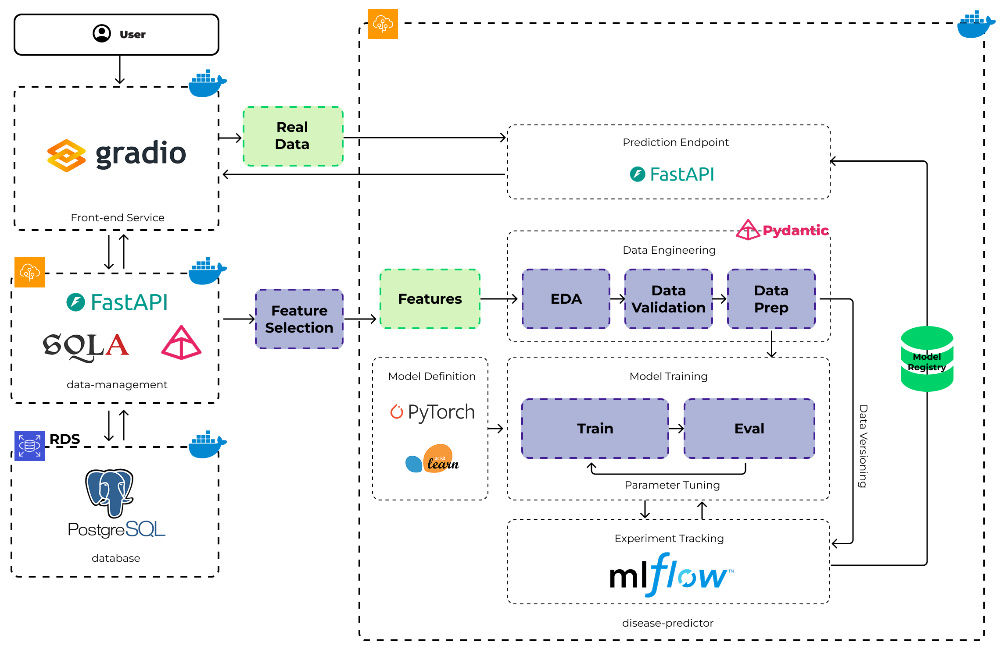

# DiaPred: A Microservices-Based Approach for Healthcare and Diabetes Prediction Service


## Project Overview

This project aims to build an advanced AI system for predicting diseases based on comprehensive health data. 
The system will integrate data from disparate sources, including sensors, imagery, health history, and other relevant datasets, to provide predictive insights into potential health issues.

The application will be developed using a microservice architecture.


## Stack

-   **Framework (AI/ML):** Scikit-learn, PyTorch.
-   **Backend:** FastAPI
-   **Frontend:** Gradio (Python)
-   **Database:** PostgreSQL
-   **Operations:** Docker
-   **Cloud:** AWS

## Directory Structure

Further details for each service will be added as development progresses. 

## Usage

This system requires Docker to run.

First, clone the repository:
```
git clone https://github.com/tannd-ds/ml-diabetes-pred
```

Then, navigate to the project directory and build the Docker images (Make sure you have Docker installed!):
```
cd ml-diabetes-pred
docker-compose build
```

With the images built successfully, the services are already running. You can access the API at `http://localhost:8001/docs` and `http://localhost:8002/docs` and the Gradio interface at `http://localhost:7860`.